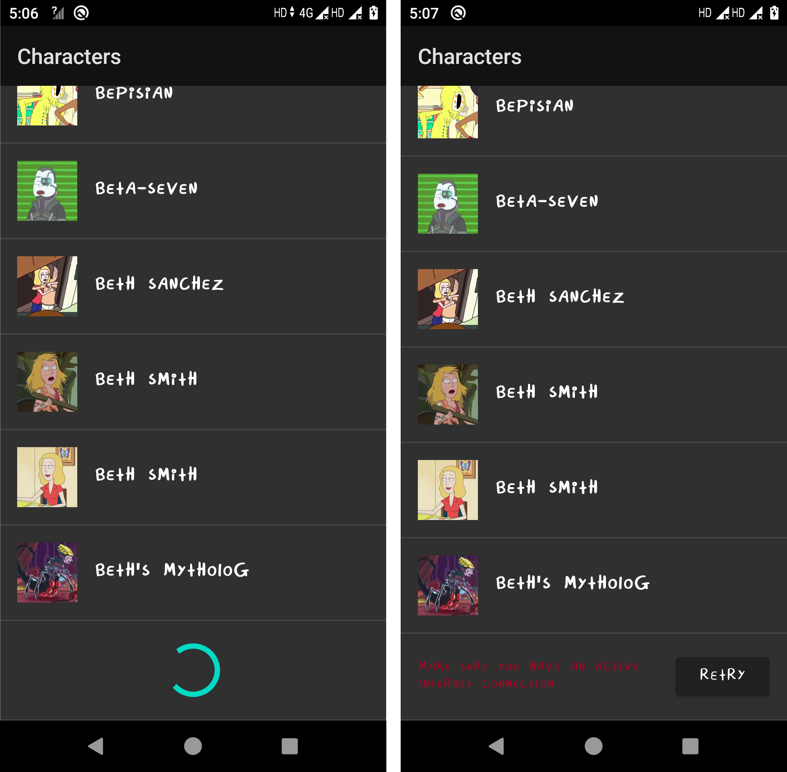

# 
Rick and Morty Android app

## Features

- Simple UI, Custom Font
- MVVM Architecture
- Flow
- Data binding
- Retrofit
- Koin DI
- Pagination v3
- Pagination footer

## Features to be added

- Paginated data db storage and retrieval
- Custom search page with API call
- Custom font for Toolbar

## Screenshots

